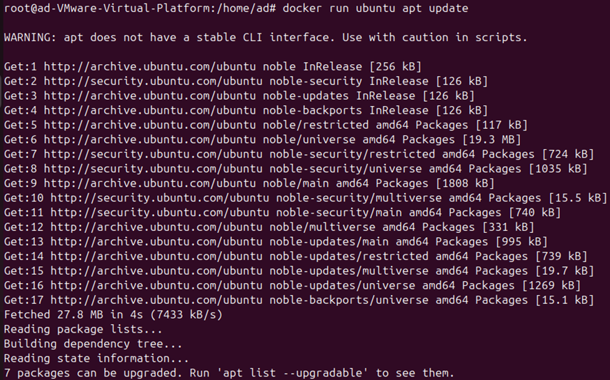
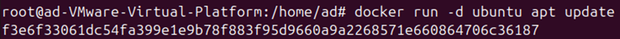
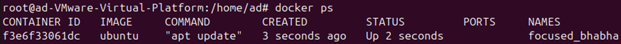
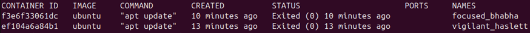

[](https://git.io/typing-svg)
# docker run *

### Создает контейнер на основе готового образа (image)
```bash
docker run hello-world
```
### Так же можно написать команду которая выполнится в запущенном контейнере
```bash
docker run ubuntu apt update
```
<center></img></center>


### Параметр `-d` позволяет запустить контейнер в фоновом режиме
<center></img></center>

# docker ps

### Позволяет посмотреть список активных контейнеров
```bash
docker ps
```
<center></img></center>

### Параметр `-a` позволяет посмотреть список всех контейнеров
```bash
docker ps -a
```
<center></img></center>

# docker rm *

### Позволяет удалить контейнер по CONTAINER_ID или NAMES

```bash
docker rm <CONTAINER_ID>
```

# docker images

### Позволяет посмотреть список загруженных образов (images)

```bash
docker images
```

# docker rmi *

### Позволяет удалить выбранный образ (image)

```bash
docker rmi <IMAGE_ID>
```

# docker pull *

### Позволяет скачать выбранные образ

```bash
docker pull ubuntu
```
#### Без указания тега репазитория будет установленна версия `latest` - `ubuntu:latest`

#### С указанием версии (тега)
```bash
docker pull ubuntu:20.04
```

# docker logs *

### Позволет посмотреть последние проделанные действия в контейнере

```bash
docker logs <CONTAINER_ID>
```

#### Параметр `-f` позволяет просматривать логи в реальном времени

```bash
docker logs -f <CONTAINER_ID>
```

# docker exec -it * /bin/bash

### a.	Позволяет перейти в интерактивную среду контейнера

```bash
docker exec -it <CONTAINER_ID> /bin/bash
```

# docker system prune -a –volumes

### Удаляет образы и остановленные контейнеры
`образ будет удален если он не используется в данный момент в контейнере`

```bash
docker system prune -a –volumes
```

# docker commit *

### Позволяет создать образ (image) на основе контейнера

```bash
docker commit «CONTEINER_ID»
```
# docker image build -t * .

### Позволяет создать образ на основе Dockerfile
#### Флаг `-t` задает тег для образа, позволяющий присвоить ему имя и версию
```bash
docker image build -t <NAME>:<TAG> .
```
