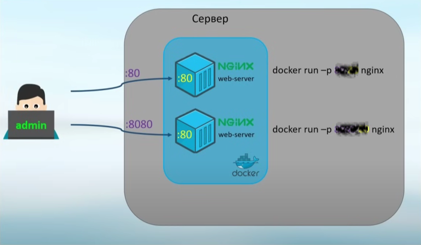

# Practical work 1

## Тема: Развертывание докер контейнеров с использованием Dockerfile

## Цель: получить навыки работы и настройки контейнеров докер с использованием Dockerfile

### *Оформление :* каждый выполненный этап подкреплять скриншотами и описанием команд, которые вы ипользовали

### Порядок работы:

#### 1) Скачать образ контейнера Nginx
#### 2) Найти и скачать (либо написать самому) две hmtl страницы
#### 3) Написать Dockerfile'ы которые при развертывании будут заменять стандартный файл index.html на ваш
#### 4) Пробросить порты с контейнеров на основную машину, для доступа к сервисам Nginx
#### 5) Продемонстрировать работу веб страниц

#### Схема работы
</img>
