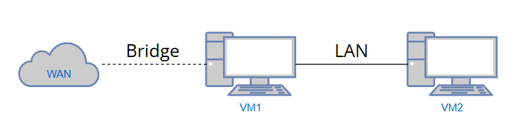

# Работа о том, не знаю о чем

## Подготовка к работе

- Работа с переадресацией пакетов
- Настройка протокола SSH и доступа через один сервер

### Установка VM

Логическая топология сети

1. VM1 : Порт bridge для доступа в WAN и доступа из сети колледжа // LAN для объединения виртуальных машин в одну сеть
2. VM2 : LAN для объединения виртуальных машин в одну сеть

### Настройка SSH | VM1

Обеспечить доступ по SSH к VM1 со следующим изъянами:

- Изменить стандартный порт подключения
- Отключить доступ для пользователя root
- Разрешить доступ по ключу
- Отключить доступ по паролю

### Настройка DHCP и DNS | VM1

- Настроить DHCP сервер для выдачи сетевых реквизитов пользователям подключенных к локальной сети
- Настроить DNS сервер для в качестве переадресовывающего на другой DNS (DNS колледжа | 10.0.20.2)
- Проверить работоспособность доступа VM друг к другу (ping)

### Настроить переадресацию пакетов | VM1

- Выполнить настройку переадресации пакетов для предоставления доступа в интернет VM2 (Делаете любым удобным для вас способом | Например : iptables)
- Проверить доступность интернета с VM2

### Настройка SSH | VM2

Так как VM2 недоступна из локальной сети колледжа необходимо:

- С помощью VM1 выполнить переадресацию SSH на VM2

### Настройка DOCKER контейнера | VM2

- Развернуть контейнер DOCKER nginx
- При развертывании указать что выполняется прослушка порта 5050 и перенаправление на порт 80 контейнера
- Изменить стартовую страницу, на страницу с информацией о вас (ФИО : Возраст : Рост : Группа)

### Настройка HAProxy

- Развернуть роль прокси сервера HAProxy
- Обеспечить послушку 80 порта
- Перенаправлять все запросы на 5050 порт VM2
- Проверить работоспособность (Вписать в браузер айпи адрес сервера VM1 должна открыться страница из контейнера VM2)

## Часть 2

### Реорганизация контейнера VM2

Остановить выполнение контейнера с nginx

- С помощью Docker Compose развернуть HAProxy с двумя Nginx
    - HAProxy должен прослушивать 5050 порт и перенаправлять клиента либо на Nginx1 либо на Nginx2 (балансировка)
    - Nginx1 должен иметь страницу на которой отображен ip адрес сервера VM2 и изображение с логической топологией вашей сети (Картинку можно скачать с гитхаба)
    - Nginx2 должен иметь страницу на которой отображен порт который слушает HAProxy и изображние с логотипом Nginx (Картинку качаем любую из интернета)
    - Все изображения должны располагаться в контейнере Nginx1 и подгружатся на html страницы с него (Все это делается с помощью HAProxy)
- Проверить работоспособность (Вписать в браузер айпи адрес сервера VM1 должна открыться страница из контейнера VM2 (nginx1), при обновлении страницы открывается другая страница VM2 (nginx2))